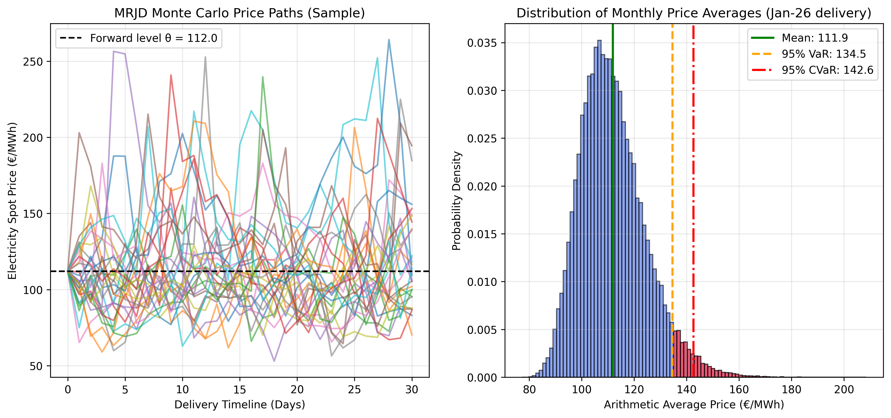
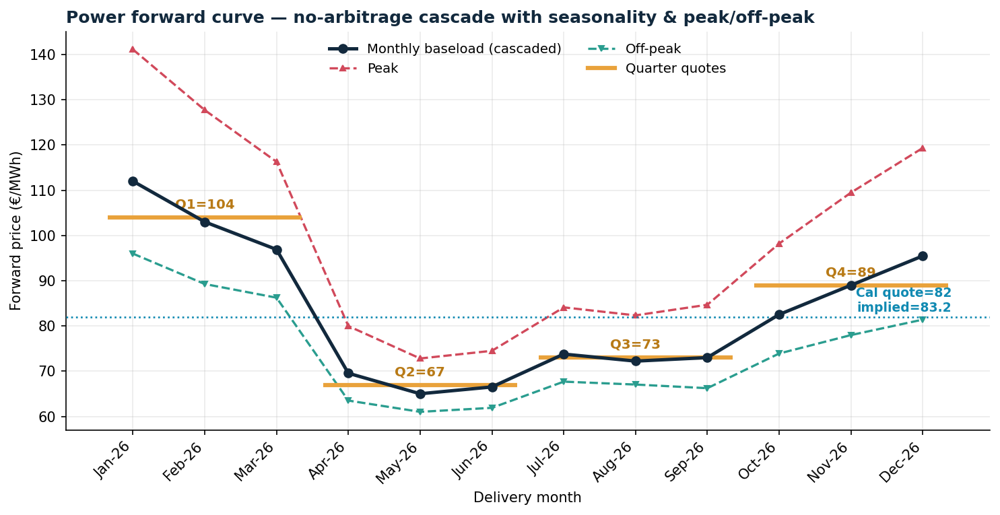
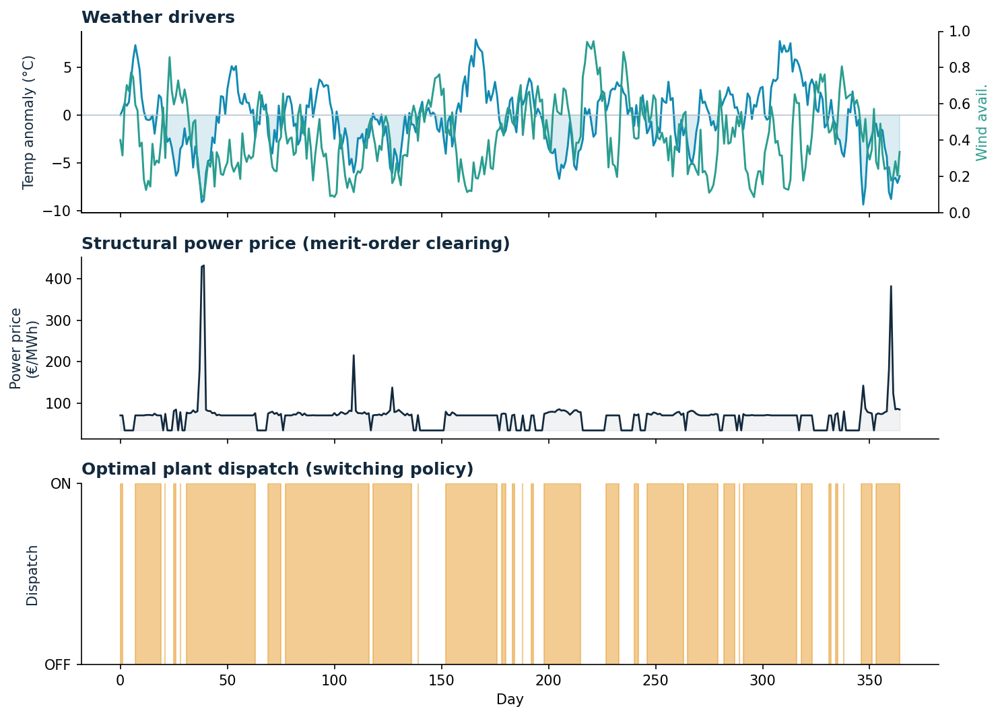

# Energy Quantitative Trading: MRJD, Derivatives Pricing & Real-Option Valuation

A production-oriented quantitative framework for **energy market risk management**: spot-price
calibration, derivatives pricing, tail-risk analysis, and the real-option valuation of a gas-fired
power plant driven by a structural, weather-based price model.

Unlike equity or FX markets, electricity cannot be economically stored at large scale. Production
must match consumption instantaneously, which renders the Geometric Brownian Motion assumption
obsolete: power prices **mean-revert** to a marginal-cost level and are punctuated by violent,
short-lived **spikes**. This repository implements a specialised **Mean-Reverting Jump-Diffusion
(MRJD)** model to capture those dynamics, and then goes one step further — replacing the exogenous
jumps with an endogenous, weather-driven merit-order mechanism to value physical assets.

---

## Core Features

- **Spike cleansing** — a rolling 3σ threshold filter isolates structural market spikes (grid
  shocks, extreme weather) from ordinary diffusive noise.
- **OLS calibration** — the underlying Ornstein–Uhlenbeck process is linearised via an
  Euler–Maruyama discretisation to estimate the speed of mean reversion (κ), long-term mean (θ),
  and volatility (σ).
- **Monte Carlo engine** — a vectorised simulator running tens of thousands of independent paths.
- **Asian option pricing** — path-dependent power derivatives settled on the arithmetic price average.
- **Tail-risk analysis** — 95% Value at Risk (VaR) and 95% Expected Shortfall (CVaR).
- **Forward curve construction** — a no-arbitrage cascade from quoted months, quarters, and the
  calendar year down to a monthly curve, with seasonality and a peak / off-peak split.
- **Structural weather-to-price model** — power prices emerge from the merit order as weather drives
  residual load; spikes are endogenous, not assumed.
- **Switching real-option valuation** — a CCGT is valued as a two-state (ON/OFF) switching option
  with start-up costs, solved by Least-Squares Monte Carlo (Longstaff–Schwartz).

---

## The MRJD model

The spot price $X_t$ follows a mean-reverting jump-diffusion:

$$dX_t = \kappa(\theta - X_t)\,dt + \sigma X_t\,dW_t + J\,dN_t$$

| Term | Meaning |
|------|---------|
| $\kappa(\theta - X_t)\,dt$ | Mean reversion toward the marginal-cost level $\theta$ at speed $\kappa$ |
| $\sigma X_t\,dW_t$ | Diffusive noise |
| $J\,dN_t$ | Compound-Poisson jumps — rare, large spikes from shocks and weather |

Because jumps and path-dependence rule out closed-form solutions, pricing and risk are computed by
simulation, which also exposes the full distribution — including the tail.

---

## Risk analysis

Running the Monte Carlo engine under the calibrated MRJD framework maps the asymmetric risk profile
of the power portfolio:

- **Expected baseline** — equilibrium pricing stays anchored near the marginal fuel cost thanks to
  strong mean reversion.
- **95% VaR** — the price threshold not exceeded with 95% confidence. It marks the edge of the tail
  but says nothing about its depth.
- **95% CVaR (Expected Shortfall)** — the conditional expectation in the worst 5% of outcomes. For
  the skewed, jump-driven distribution of power, CVaR is the reliable capital-allocation metric:
  VaR alone structurally understates spike severity.



---

## Forward curve construction

A power desk trades forwards, not the spot. Quoted products (front months, quarters, the calendar
year) must be mutually consistent by no-arbitrage: the time-weighted average of the finer contracts
inside a period equals the price of the coarser contract covering it.

$$\text{Cal-26} = \operatorname{avg}(Q_1,Q_2,Q_3,Q_4), \qquad Q_1 = \operatorname{avg}(\text{Jan},\text{Feb},\text{Mar})$$

`forward_curve.py` cascades the quotes down to a full monthly curve: directly quoted months are used
as-is, an unquoted month inside a quoted quarter is backed out by no-arbitrage, and a quarter with no
quoted months is shaped into months by a seasonal profile constrained to average back to the quarter
quote. The standalone Cal quote is then used as an independent consistency check — the residual
between the quoted Cal and the strip-implied Cal is the calendar basis. Each monthly baseload price is
finally split into peak and off-peak legs that hour-weight back to the baseload.

This term structure is what the spot model should be anchored to: the flat long-term mean $\theta$
becomes a time-varying $\theta(t) = \text{forward}(t)$, so an option or a plant is valued against the
correct delivery-period level rather than a single global average.



---

## Weather-driven structural pricing and plant valuation

Rather than assuming an exogenous jump process, `plant_valuation.py` builds power prices from the
**merit order**. Two stochastic weather drivers — a temperature anomaly and a wind-availability
index — determine electricity demand (heating / cooling) and renewable supply. Their difference is
the **residual load**, and the clearing price is the marginal cost of the last unit dispatched to
serve it:

$$\text{residual load} = \text{demand}(\text{temperature}) - \text{renewables}(\text{wind})$$

As residual load rises (a cold snap coinciding with a wind lull), the market moves right along the
stack — from cheap baseload, onto gas, and finally into scarcity-priced peakers — so **spikes emerge
endogenously** from the physical mechanism.

The plant itself is valued as a **switching real option**. A CCGT is dispatched ON/OFF each day, and
switching it on incurs a start-up cost, so the optimal policy is *not* the myopic "run whenever the
spark spread is positive." The two-state control problem is solved by Least-Squares Monte Carlo
(Longstaff–Schwartz) with backward induction, and a forward pass then simulates the optimal dispatch
path. Comparing the frictionless "strip of daily options" benchmark against the switching value
isolates the economic cost of cycling — the value a myopic strategy would destroy.



*A cold snap combined with a wind lull pushes residual load into the scarcity tranche, spiking the
price; the optimal switching policy keeps the plant running through the event. The plant's value is
concentrated in these weather-driven tail events — the financial expression of a climate hazard.*

---

## Repository structure

```
energy-quant-trading/
├── README.md
├── requirements.txt
├── .gitignore
├── data/
│   ├── calibration_results.png   # MRJD fit & spike cleansing
│   ├── forward_curve.png         # no-arbitrage forward curve (seasonality, peak/off-peak)
│   ├── risk_profile.png          # VaR / CVaR distribution
│   └── weather_dispatch.png      # weather -> price -> dispatch (structural model)
└── src/
    ├── calibration.py            # MRJD data, spike cleansing, OLS / Euler–Maruyama calibration
    ├── pricing.py                # Monte Carlo engine + Asian options
    ├── forward_curve.py          # no-arbitrage cascade: months/quarters/cal -> monthly curve
    ├── risk_analysis.py          # VaR / CVaR tail metrics
    ├── plant_valuation.py        # weather-driven merit order + switching LSM valuation
    └── main.py                   # single entry point: runs everything, regenerates all charts
```

---

## Installation

```bash
git clone https://github.com/alemef96/energy-quant-trading.git
cd energy-quant-trading

python -m venv .venv
# Windows (PowerShell):
.venv\Scripts\Activate.ps1
# macOS / Linux:
# source .venv/bin/activate

pip install -r requirements.txt
```

## Usage

Run the whole pipeline from the project root — this regenerates every chart in `data/`:

```bash
python src/main.py
```

Each module can also be run on its own:

```bash
python src/calibration.py       # estimate κ, θ, σ and jump parameters
python src/forward_curve.py     # build the no-arbitrage forward curve
python src/risk_analysis.py     # Monte Carlo + VaR / CVaR
python src/plant_valuation.py   # weather-driven pricing + switching valuation
```

---

## Methodology notes

- **Calibration.** Spikes are filtered with a rolling 3σ rule before the OU parameters are estimated,
  so diffusion volatility isn't inflated by jumps; jump frequency is then read off the filtered events.
- **Risk metrics.** For a skewed, jump-driven distribution, VaR marks a threshold but ignores the
  depth of the tail beyond it; CVaR averages the worst-case outcomes and is the more reliable
  capital-allocation metric.
- **Real-option valuation.** A gas plant runs only when the clean spark spread is positive. That
  optionality — plus the start-up cost of cycling — is valued with Least-Squares Monte Carlo,
  regressing continuation values against the spread across the simulated paths.

## Roadmap

- Stochastic, correlated fuel and carbon prices (a cold snap raises gas cost as well as power demand).
- Multi-state plant constraints: minimum-load, ramp rates, and minimum up/down times (swing-option form).
- Conditioning scarcity/jump frequency on climate projections to stress-test asset fair value.